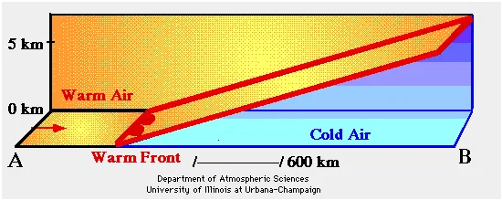
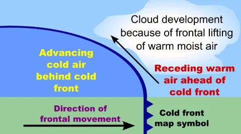

### Air Mass
  1. intro 
  2. concept
  3. role in climate change
  4. conclusion

---

1. Intro:
   - A large volume of air with uniform temperature and humidity generally extending upto thousands of kilometers horizontally over a source region.
2. Formation:
   - stationary wind
   - uniform source region 
   - several days or weeks 
   - absorbs props(T & H) of source region

3. Classification
   - **Temperature:** Tropical (T) / Polar (P).
   - **Humidity:** Continental (c - dry) / maritime (m - moist).
   - **Classification (cT, cP, mT, mP):**
   - **Stability:** rise or sink tendency
  
4. Frontogenesis is the birth or strengthening of the boundary (front) separating two distinct air masses with different densities(T and H).
   1. Warm Front: Warm air mass is more active.
      1. Gentle slope
      2. rainfall over a large area
      3. stratonimbus(layered rain bearing clouds)
      4. 
   2. Cold Front: Cold air mass is more active.
      1. Steep slope
      2. rainfall over a small area
      3. cumulonimbus cloud
      4. 
   3. Occluded Front: rotating cold air mass overtakes warm airmass
5. Frontolysis is the meteorological process involving the weakening or dissipation of a weather front. 

6. role in weather and climate
   1. frontal precipitation with cold, warm and occuluded fronts.
      1. eg: western disturbances
   2. Interaction of warm moist mT air with dry airmass cT generates squall lines and supercell tornadoes.
   3. Atmospheric influence: dry subsiding airmasses(cT, cP) yield anticyclonic, stable and couldless skies.
   4. Aridity: Stable descending cT air masses sustain global subtropical high pressure deserts
      1. eg: Sahara, Atacama, Great Australian Desert
   5. Global heat transport from tropics to polar
   6. Cold waves polar outbreaks meanders JetStreams
   7. mT drives monsoon

7. Conclusion: Air masses are moving reservoir of heat and moisture, making their tracking indispensable for agriculture and water management and climate-resilient planning.