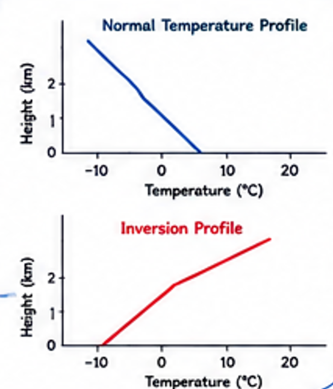

### Temperature inversion
   1. intro 
   2. concepts
   3. process of occurring
   4. places of occurring
   5. effect and impact
   6. Conclusion

---

1. intro 
   1. Temperature inversion is a phenomenon/reversal of the normal decrease of temperature with height, where a layer of warm air overlies/sits above a layer of cooler air near the Earth's surface.
2. concepts
   1. Normal Lapse Rate: Temperature decreases with height ~6.5 deg C per km in troposphere.
   2. Inversion: Temperature increases with height over a certain layer.
   3. 
3. process of occurring
   1. Strong radiational cooling in clear sky(especially at night / winter),Surface heat lost to space
   2. Rapid surface cooling,Surface cools rapidly,Low temperature near ground
   3. Cool dense air settles,Cool dense air remains near the surface,Cold air is heavier
   4. Warm air aloft,Warm air aloft remains or moves over the cool layer,"Warm air acts as a lid.
   5. Formation of stable layer,"Formation of a lid or stable layer → Inversion",Prevents vertical mixing

4. places of occurring
   1. High latitudes (Polar regions),"Arctic, Antarctica"
   2. Winter season in mid-latitudes,"N. America, Europe, Asia"
   3. Valley regions,"Kashmir Valley, Kullu Valley, Alps, Andes"
   4. Urban areas (pollution inversions),"Delhi-NCR, Beijing, LA Basin"
   5. Over oceans and coastal regions,"Off coasts of California, Peru"

5. effect and impact
   1. Benefits
      1. Protects crops and vegetation: Shields plants from severe frost by trapping warmer air above.Example: Orchards in valleys during winter.
      2. Aviation & Astronomy: Provides stable atmospheric conditions useful for flights and astronomical observations.Example: Clear skies for astronomical observations above the inversion layer.
      3. Snow preservation: Helps in maintaining snow cover in mountains by reducing vertical mixing of air.
   2. Problems
      1. Pollution entrapment: Traps air pollutants near the surface -> Poor air quality, smog, and severe health issues.
         1. Example: Smog episodes in Delhi (especially in winter).
      2. Respiratory hazards: Increases risk of respiratory diseases (asthma, bronchitis).Data: WHO (2023) estimates $\sim 99\%$ of the global population breathes air exceeding WHO air quality guidelines.
      3. Reduced visibility: Affects transport systems (road, air, rail).Example: Fog + inversion in Indo-Gangetic Plains.
      4. Vertical dispersion blockage: Hinders vertical dispersion of smoke, fog, and moisture.
6. Conclusion
   - Inversion has dual impacts(ecosystem activities vs health hazard), but urban pollution exacerbates its risks—requiring integrated air quality management and climate-resilient urban planning.