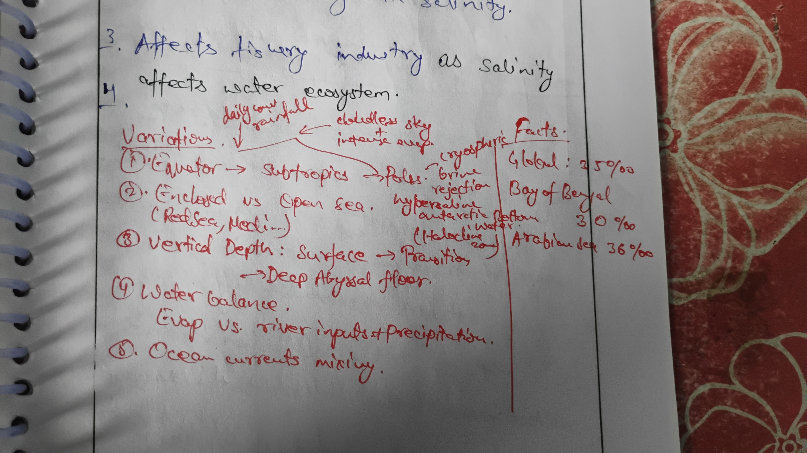

### Salinity
1. Intro
2. Variation in global ocean salinity
3. Order of salinity in oceans and seas
4. Effect and impact
5. Conclusion

---

1. Intro
   - Salinity is the measure of the total concentration of dissolved salts in seawater, typically expressed in parts per thousand (ppt or ‰).
   - global average ocean salinity is about 35‰.
   - Oceanic salinity (averaging $35\text{‰}$) is governed by the dynamic equilibrium between freshwater flux and surface evaporation, serving as the master engine of planetary thermohaline circulation

2. Variation in global ocean salinity
   - **Factors Increasing Salinity:**
     - **Evaporation:** ∝
     - **Formation of Sea Ice:** ∝
   - **Factors Decreasing Salinity:**
     - **Precipitation:** 1/∝
     - **River Runoff:** 1/∝
     - **Melting of Ice:** 1/∝
   - **Latitudinal Variation:** Salinity is generally low at the equator (high rainfall), high in the subtropics (high evaporation), and low again in polar regions (ice melt).
   - 
3. Order of salinity in oceans and seas
   - **Highest Salinity Seas:** Red Sea (~40‰) and Mediterranean Sea (~38‰) due to high evaporation and limited freshwater inflow.
   - **Lowest Salinity Seas:** Baltic Sea (~5-15‰) due to large river runoff and low evaporation.
   - **Oceans:** The Atlantic Ocean is slightly saltier on average than the Pacific and Indian Oceans.

4. Effect and impact
   - **Drives Thermohaline Circulation:** Salinity, along with temperature, determines the density of seawater. Cold, salty water is dense and sinks at the poles, driving the deep-ocean "global conveyor belt" that circulates heat around the planet.
   - **Affects Marine Life:** Organisms are adapted to specific salinity ranges. Changes in salinity can stress or kill marine life and alter ecosystem composition.
   - **Influences Freezing Point:** Saltwater has a lower freezing point than freshwater (approx. -2°C), which affects the formation of sea ice.
   - **Creates Halocline:** A sharp vertical gradient in salinity, which can act as a barrier to mixing between water layers, affecting nutrient and oxygen distribution.

5. Conclusion
   - Salinity is a fundamental property of seawater that plays a crucial role in driving global ocean circulation and shaping marine ecosystems.
   - From sustaining fragile coral ecosystems to regulating global heat redistribution, oceanic salinity variations remain a cornerstone of marine biogeochemistry and planetary climate stability.