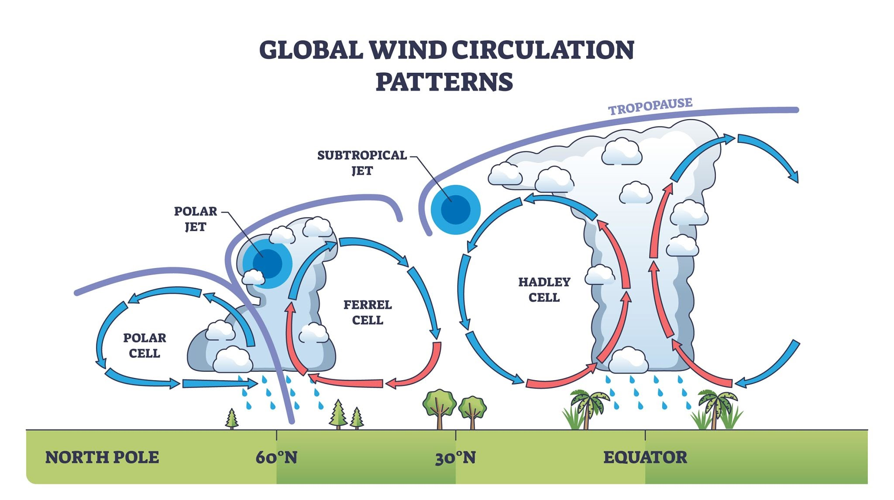

### Jet Streams
1. Intro: 
2. How does it occur ?
3. What are its impacts ?
4. Conclusion

---

1. Intro: Jet streams are narrow, high-altitude geostrophic wind bands in the upper troposphere, critically steering mid-latitude weather systems, aviation routes, and global thermodynamics.
   1. 
   2. 
2. How does it occur ?
   1. Pressure gradient
   2. Wind movement(H -> L)
   3. Coriolis effect(right deflection in NH)
   4. Geostrophic Balance:
   5. W -> E flow
3. What are its impacts ?
   1. Divergent Jet Streams: 
      1. convective updrafts, cloud formation, and mid-latitude temperate cyclones.
   2. Convergent Jet Streams:
      1. surface anticyclones, clear skies, and dry weather.
   3. Deep south dipping toughs cause Polar vortex spill
   4. Subtropical Westerly jet stream brings winter rainfall crucial for rabi crops
   5. Sudden collapse of STWJS due to intense heating of Tibetan plateau causes burst of monsoon.
   6. Tropical Easterly Jetstreams drives Indian monsoon
   7. Separates climatic zones: 
   8. Aviation fuel economy for W->E
4. Conclusion: Tracking jet stream meandering and Rossby wave stability is crucial for forecasting Western Disturbances, erratic monsoon dynamics, and climate-induced mid-latitude thermal extremes.