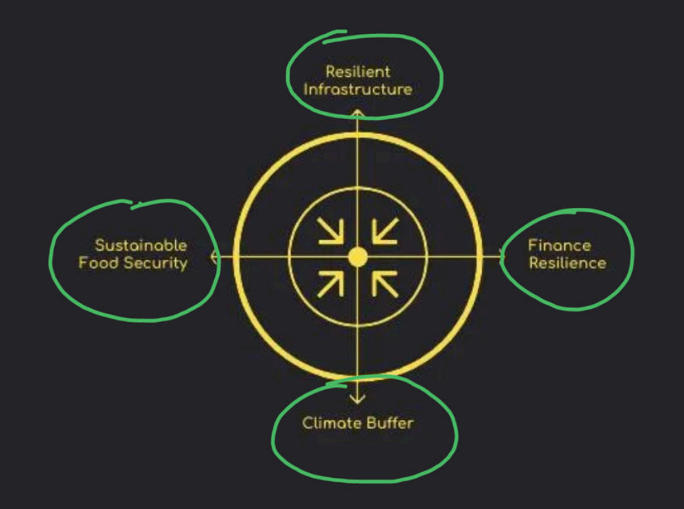

### Food Security
1. Intro
2. Challenges
3. Way forward
4. Govt schemes
5. Conclusion

---

1. Intro
   - Food security is a critical issue that affects the health and well-being of populations worldwide. It encompasses the availability, access, and utilization of food to ensure that all individuals have sufficient, safe, and nutritious food to meet their dietary needs.
2. Challenges 
   - Climate change and extreme weather events
   - Pests and diseases affecting crops
   - Soil degradation and loss of arable land
   - Water scarcity and inefficient irrigation practices
   - Economic and political instability affecting food distribution
   - Global trade disruptions and market volatility
   - Population growth and urbanization leading to increased demand for food
   - Food waste and loss throughout the supply chain
3. Way forward
   - Early warning system
   - Implement sustainable agricultural practices to enhance productivity and resilience
   - Invest in research and development for climate-resilient crops and innovative farming techniques
   - Strengthen food supply chains and improve storage and transportation infrastructure
   - Promote policies that support smallholder farmers and equitable access to resources
   - Enhance international cooperation to address global food security challenges
   - Encourage public awareness campaigns on nutrition, food waste reduction, and sustainable consumption 
   - Develop social safety nets and targeted assistance programs for vulnerable populations
   - 
4. Govt schemes
   - National Food Security Act (NFSA) 2013: Provides subsidized food grains to eligible households,  
   - Mid-Day Meal Scheme: Aims to improve the nutritional status of school-age children by providing free meals in schools.
   - Integrated Child Development Services (ICDS): Offers food, health, and education services to children under six years of age and their mothers.
   - Public Distribution System (PDS): Ensures the distribution of essential commodities at subsidized rates to low-income households.
   - National Nutrition Mission (POSHAN Abhiyaan): Focuses on improving nutritional outcomes for children, pregnant women, and lactating mothers through various interventions and awareness campaigns.
5. Conclusion
   - Addressing food security requires a multi-faceted approach that combines sustainable agricultural practices, effective government policies, and international cooperation. By tackling the challenges and implementing innovative solutions, we can ensure that all individuals have access to sufficient, safe, and nutritious food, ultimately contributing to improved health and well-being for populations worldwide.