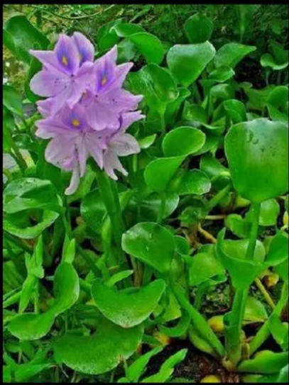

1. The ICAR-National Bureau of Animal Genetic Resources (NBAGR) officially registered these two as indigenous cattle breed.
   1. Vechur Cow
   2. Periyar Kullan(local names: Kuttampuzha cattle and Andukanni)
2. Vultures
   1. vulture electrocution (गिद्धों के विद्युत आघात). - studied was near Sudhauwala in Dehradun, Uttarakhand
   2. highly acidic digestive system which destroys the pathogens in carcasses reducing the risk of Anthrax and botulism
   3. Indicator species
   4. India home to 9 out of 23 vulture species: India’s nine: 
      1. White-rumped-CR 
      2. Indian (Long-billed)-CR
      3. Slender-billed-CR
      4. Red-headed - CR
      5. Himalayan Griffon- NT(Near Threatened)
      6. Eurasian Griffon - LC
      7. Egyptian - EN
      8. Cinereous - NT
      9. Bearded Vulture (Lammergeier) - NT
   5. Importance: the vulture collapse llowed feral dog populations(आवारा कुत्तों की आबादी) to surge, raising rabies (रेबीज़) risk
   6. Threats
      1. vetenary diclofenac(non-steroidal anti-inflammatory drug — NSAID) - 97% decline in pop in some regions - banned vetenary diclofenac in 2006
      2. electrocution from high tension power infrastructure
      3. other NSAID - aceclofenac and ketoprofen
      4. food scarcity
      5. habitat loss
   7. Conservation measures
      1. Vulture Conservation Breeding Programme
      2. Safer alternative drug: meloxicam - non toxic to vultures
      3. Vultures Safe Zones - Free of NSAIDs
      4. Vulture Awareness Day: 1st Sat of Sept
3. Water Hyacinth(Eichhornia crassipes) Menace in Vembanad Lake
   1. Kumarakam, Kerala
   2. to control spread of this invasive species
   3. Native to the Amazon Basin of South America
   4. introduced in India as an ornamental plant
   5. other invasive species:(pyq) 
      1.  Lantana camara, 
      2.  African Catfish,
      3.  Prosopis
      4.  juliflora, 
      5.  apple snail.
      6. 