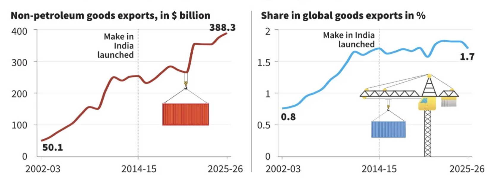
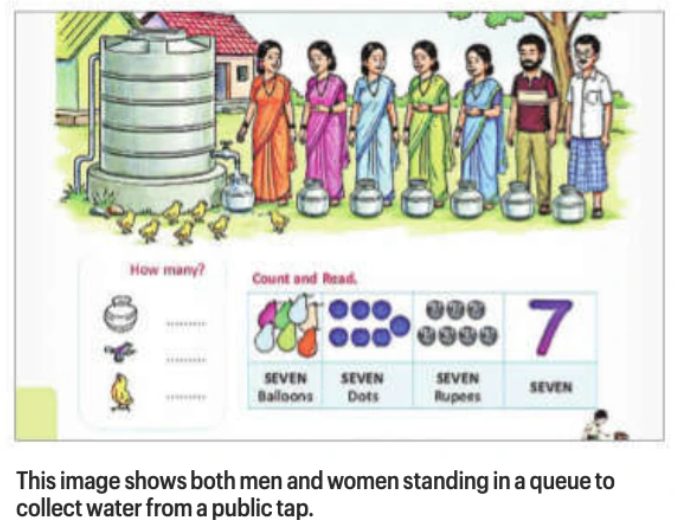

1. Political parties: enjoy the benefit of income-tax exemption
2. Association for Democratic Reforms (ADR) released a report on July 18, 2025, which found a 223% rise in the declared income of RUPPS in FY2022-23.
3. Kanhiya Lal Omar vs R.K. Trivedi and Others: ?
4. France-Mexican initiative (2015): France proposed that the five permanent members (P5) of the UNSC voluntarily refrain from using the veto in situations involving genocide, crimes against humanity and large-scale war crimes. The initiative has gained renewed momentum, with 128 UNGA members supporting it, including the recent endorsement by the UK.: restraint, not abolition of the veto: P5 divisions have constrained UNSC action, particularly on conflicts such as Syria
5. Koli: accusset in Nitihari case(2006) spent 20 years in jail acquitted by SC(Nov, 2025) suicided on sept 18, 2026. - deep pain without any wrong doing - structural failure of Law institutions
6. CEC is first among equals not the seniormost.
7. Index of Industrial Production (IIP) data, which comes out once a month
8. 12 years of Make in India: 
9. Endoscopy is particularly important when there are alarm symptoms such as difficulty or pain while swallowing, bleeding, unexplained weight loss
10. According to the National Crime Records Bureau (NCRB) data, the number of crimes against children filed under the POCSO Act rose to 1,77,335 in 2023 from 1,62,449 in 2022.
11. MDR on UPI(peer to merchant) from 15th Oct beyond 2000

---

1. Bank: UPI MDR charges are not enough
2. Keralam HC: V high consumer cases - low judicial infra
3. 81st session of the United Nations General Assembly (UNGA)
4. Lotteries - need regulation not prohibition - biggest revenue source: Lotteries (Regulation) Act, 1998
5. Kar SG rejected Kasturirangan report: Gadgil and the Kasturirangan Reports restrict/ ban such as mining,
6. India should revisit its 20 years old Nuclear Doctrine: operationalised in 2003 - new advancements in China-Pak nuclear capacity
7. SIT formed to probe into CEC: Gyanesh Kumar's case
8. Phone price hikes due to AI chips
9. Tea production declined: 1.7% in - United Planters' Association of Southern India (UPASI)
10. Iran want to end the war
11. PM Modi to visit multiple countries in Dec for G20 meetings and to seal bilateral trade with Canade and other countries
12. India-Liberia partnership to save commercial maritime: Suraj Yadav lost his live in a missile attack around St. of Hormuz - S. Jaishankar raised concerns about this
13. Election Commissioners differ in opinion on any matter, such matter shall be decided according to the opinion of the majority," Section 18 of the Business of the Chief Election Commissioner and Other Election Commissioners (Appointment, Conditions of Service and Term of Office) Act, 2023
14. The Supreme Court judgment in T.N Seshan vs. Union of India in 1995 made it clear that the three members would have an equal say in decision-makingclear that the three members would have an equal say in decision-making.
15. Xiaoyu - Chinese girl mental health issue: 
16. Indonesia has developed a 24x7 digital platform aimed at responding to mental health
17. Gender Equality: 1st Grade textbook of Andhra Pradesh: 
18. India imports all GPUs - IIT Delhi team(1 prof + 2 students) developed 1st ever indigeneous GPU.
19. Franklin D Roosevelt of the US and Winston Churchill of Great Britain, came together to proclaim the Atlantic Charter in 1941.
20. SHANTI (Sustainable Harnessing and Advancement of Nuclear Energy for Transforming India) Act
21. Nuclear Sector - open to FDI - SHANTI Act for regulations - France to deploy European Pressurised Reactors (EPRS) in India
22. 4-5 Bilateral Investment Treaty to be finalised soon.
23. India: 50000 km highway plan for 2036-37
24. Taiwan became the world's number one chip maker [chips or semiconductors are essential for producing key electronic components]
25. US-Trump have shifted their inclination with mainland China raising concerns for Taiwan.
26. Replacing dollar is tough task: Over 50% of Global Transactions are done in Dollar + Over 50% of Foreigh Exchange are held in Dollars. Yuan - More than economic size - needs trust and policies of global standard.