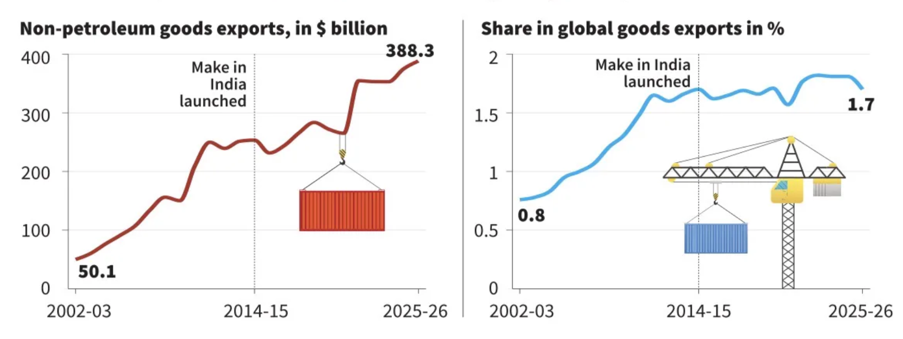
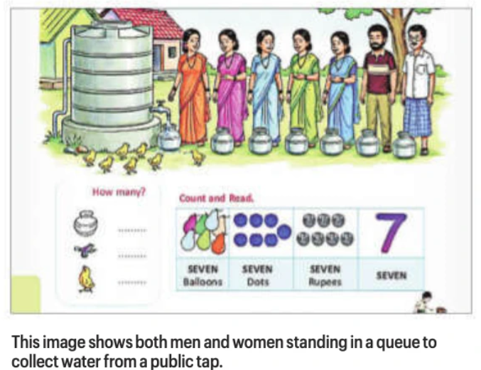

1. Political parties: enjoy the benefit of income-tax exemption
2. Association for Democratic Reforms (ADR) released a report on July 18, 2025, which found a 223% rise in the declared income of RUPPS in FY2022-23.
3. Kanhiya Lal Omar vs R.K. Trivedi and Others: ?
4. France-Mexican initiative (2015): France proposed that the five permanent members (P5) of the UNSC voluntarily refrain from using the veto in situations involving genocide, crimes against humanity and large-scale war crimes. The initiative has gained renewed momentum, with 128 UNGA members supporting it, including the recent endorsement by the UK.: restraint, not abolition of the veto: P5 divisions have constrained UNSC action, particularly on conflicts such as Syria
5. Koli: accusset in Nitihari case(2006) spent 20 years in jail acquitted by SC(Nov, 2025) suicided on sept 18, 2026. - deep pain without any wrong doing - structural failure of Law institutions
6. CEC is first among equals not the seniormost.
7. Index of Industrial Production (IIP) data, which comes out once a month
8. 12 years of Make in India: 
9. Endoscopy is particularly important when there are alarm symptoms such as difficulty or pain while swallowing, bleeding, unexplained weight loss
10. According to the National Crime Records Bureau (NCRB) data, the number of crimes against children filed under the POCSO Act rose to 1,77,335 in 2023 from 1,62,449 in 2022.
11. MDR on UPI(peer to merchant) from 15th Oct beyond 2000

---

1. Bank: UPI MDR charges are not enough
2. Keralam HC: V high consumer cases - low judicial infra
3. 81st session of the United Nations General Assembly (UNGA)
4. Lotteries - need regulation not prohibition - biggest revenue source: Lotteries (Regulation) Act, 1998
5. Kar SG rejected Kasturirangan report: Gadgil and the Kasturirangan Reports restrict/ ban such as mining,
6. India should revisit its 20 years old Nuclear Doctrine: operationalised in 2003 - new advancements in China-Pak nuclear capacity
7. SIT formed to probe into CEC: Gyanesh Kumar's case
8. Phone price hikes due to AI chips
9. Tea production declined: 1.7% in - United Planters' Association of Southern India (UPASI)
10. Iran want to end the war
11. PM Modi to visit multiple countries in Dec for G20 meetings and to seal bilateral trade with Canade and other countries
12. India-Liberia partnership to save commercial maritime: Suraj Yadav lost his live in a missile attack around St. of Hormuz - S. Jaishankar raised concerns about this
13. Election Commissioners differ in opinion on any matter, such matter shall be decided according to the opinion of the majority," Section 18 of the Business of the Chief Election Commissioner and Other Election Commissioners (Appointment, Conditions of Service and Term of Office) Act, 2023
14. The Supreme Court judgment in T.N Seshan vs. Union of India in 1995 made it clear that the three members would have an equal say in decision-makingclear that the three members would have an equal say in decision-making.
15. Xiaoyu - Chinese girl mental health issue: 
16. Indonesia has developed a 24x7 digital platform aimed at responding to mental health
17. Gender Equality: 1st Grade textbook of Andhra Pradesh: 
18. India imports all GPUs - IIT Delhi team(1 prof + 2 students) developed 1st ever indigeneous GPU.
19. Franklin D Roosevelt of the US and Winston Churchill of Great Britain, came together to proclaim the Atlantic Charter in 1941.
20. SHANTI (Sustainable Harnessing and Advancement of Nuclear Energy for Transforming India) Act
21. Nuclear Sector - open to FDI - SHANTI Act for regulations - France to deploy European Pressurised Reactors (EPRS) in India
22. 4-5 Bilateral Investment Treaty to be finalised soon.
23. India: 50000 km highway plan for 2036-37
24. Taiwan became the world's number one chip maker [chips or semiconductors are essential for producing key electronic components]
25. US-Trump have shifted their inclination with mainland China raising concerns for Taiwan.
26. Replacing dollar is tough task: Over 50% of Global Transactions are done in Dollar + Over 50% of Foreigh Exchange are held in Dollars. Yuan - More than economic size - needs trust and policies of global standard.

---

1. Elec Comm: voters left out on SIR can apply now for electoral enrollments
2. "Four Fs" of Food, Fuel, Fertilizers and Finance. - penality due to west conflict
3. S. Jaishankar: remarked Shehbaz Sharif(called Op Sindoor: violation of HR, rein of terror brought by BJP): ZERO TOLERANCE POLICY
4. Democracy in Elec Comm: S.S. Dhanoa versus Union of India (1991)
5. India slams Pak's deceit at UNGA
6. POCSO Act - no immunity to personal laws: Muslim Girl at 16 married and got preganent attracted POCSO Criminal case - Delhi HC (Protection of Children from Sexual Offences (POCSO) Act)
7. Wider mediation for family feuds
8. Chicago - most populous in US; L. Michigan
9. C<->N atom swap possible in an experiment at Univ of Chicago
10. Rich countries have concerining opinion about AI-job losses: Pew Research Centre Survey of over 42,000 adults across 37 countries
11. 20% reduction in Emergency deaths in city hospital of Haryana with PPP model: Har Govt + Sunsox technologies by installing tale-ECG devices in rural clinics
12. How are the CEC and ECs appointed? Why did the Supreme Court intervene in appointments? What did the Anoop Baranwal judgment prescribe? Who was on the appointment panel prescribed by the Supreme Court? What protection does a CEC have against removal?
    1.  Ans: Anoop Baranwal v. Union of India; The Act also provides for a Search Committee headed by the Union Law Minister, prepares a panel of five persons for consideration by the Selection Committee.; A removal motion has to be passed by the required special majority in both Houses of Parliament. Only after Parliament passes the motion can the President issue an order removing the CEC. The procedure is set out in the Judges (Inquiry) Act, 1968.; sec 16 - protection of a person who is or was CEC - Act, 2023
13. Kar SG rejects Kasturirangan Committee demanding 1 year extension and physical verification of ESA to be notified under this act: Ban Activities: mining, quarrying, sand extraction, setting up red-category industries, thermal power plants, and construction of buildings beyond 20,000 square metres.
14. Trump rejects Iran's proposal to end the War
15. S Jaishankar slams Pak at UNGA
16. Form 6 of Electoral enrollment in debate
17. Maharashtra declared drought due to less rainfall(798.2mm out of 970.9mm(benchmark of normal rainfall)) in 265 out of 358 tehsils bringing relief features of VB-G-RAM-G and land taxation + other minor taxes
18. Pak: 'halting Indus Water Treaty is an Act of War'; Ind: export of terrorism by Pak at UNGA
19. 1972: Drought in Maharashtra: NCP chief - Sharad Pawar said: this year's drought could be worse that 1972
20. Sept 10: Power Demand 269 GW, Peak power demand of this year: 270 GW recorded in May; Govt issued emergency mechanism and issued order to operate at max capacity to 112 captive coal fired power plants(50 GW+ capacity)
21. Centre: put 13 offshore minerals location to auction - did not get much response from investors
22. Centre put 2 offshore minerals to notification near Great Nicobar in Andaman Sea: req estimation of metallic richness before extraction. Key interest Poly Metallic Nodules: key elements: Co, Ni, Mn, Cu + rare earth metals
23. Good FDI inflow for India
24. Google is set to send world's first ever AI data centre to space through Falcon 9 rocket from Vandenburg Space force base near California on 1st Oct
25. China US agrees to cut $30 B tarrif cut.

---

1. De-Sinification is not easy
2. Kashmir - gateway to Central Asia and Europe
3. Form 26: pending case disclosure Sec 33A of RoP Act
4. need proper law for missing person
5. should voting be a FR
6. Pompuhar - Chola port city near Cauvery delta
7. Trade truce btw US-China leaving India exposed to additional tarrif for purchasing Russian Oil
8. AI helped in rescuing people stuck in Nepal Disaster - indentifying silos hospitals, building, places where high probability of finding people existed
9. AI breaking into govt sys - US and Australia --- report says
10. Decreased monsoon -> import duties cut on oils 
11. 2014: 2.82 GW -> 2026: 168.04 GW solar energy capacity; India 3rd largest after US and China; Allow subsidy in PM KUSUM to benefit farmers like PM Surya Ghar subsidy
12. G2 global order shaping global policies: US - China
13. CEC removal process

---
1. (A/76/262) - UNSC Gen Assembly resolution
2. 2024 report of the UN's highest financial oversight body (ACABQ)